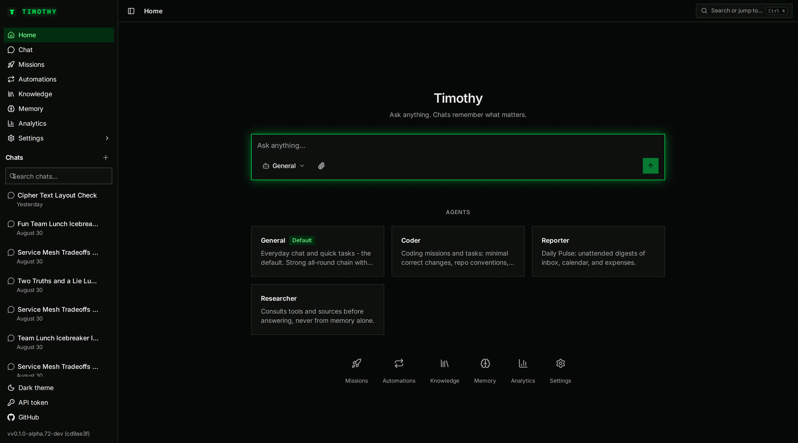

# Timothy

[](https://github.com/timothy-agent/timothy/actions/workflows/ci.yml)
[](https://codecov.io/gh/timothy-agent/timothy)
[](https://github.com/timothy-agent/timothy/releases/latest)
[](https://go.dev)
[](https://react.dev)
[](https://www.typescriptlang.org)
[](https://www.postgresql.org)
[](LICENSE)



**The personal AI assistant you actually own.** Timothy runs on your hardware and works for you around the clock: it chats, researches, and writes code; it reads your inbox and calendar and briefs you about what matters; it remembers who you are across every conversation; and it delivers results to your phone while you sleep. Every conversation, memory, document, and API key stays on infrastructure you control.

Use any model you want: Anthropic, OpenAI, Amazon Bedrock, GLM, a local Ollama, or any compatible endpoint. Route each kind of work to whichever model does it best, switch anytime from settings, no code changes, no lock-in.

**Status: early, under active development.** 

Alpha releases with prebuilt images are available on the [Releases page](https://github.com/timothy-agent/timothy/releases); expect rough edges and breaking changes between releases.

## Features

| Feature | What you get |
|---|---|
| **One assistant, every model** | Anthropic, OpenAI, Amazon Bedrock, local models via Ollama, or any compatible provider, all behind one interface. Pick which model handles chat, coding, research, or briefings, and let Timothy fail over to a backup when a provider has a bad day. |
| **Give it real work** | Hand Timothy a task (research a topic, write a report, fix a bug) and it works unattended: plans, executes, verifies its own output, and shows you the result with a full timeline of what it did. Quick tasks skip the ceremony and just get done. |
| **Results find you** | Any task or schedule can deliver its result to Telegram, email, or a webhook the moment it finishes, files attached. No checking a dashboard: the answer lands where you already are. |
| **It writes code safely** | Coding tasks run in isolated per-language sandboxes (Go, Node, Python, Java, PHP), on their own git branch, with the work verified before you see it. It can even drive Claude Code or Codex for you while keeping review and budgets in your hands. |
| **Your daily briefings** | Wake up to a digest of your inbox, calendar, and spending, delivered to Telegram or email in your timezone, saying only what actually needs your attention. Schedule any task to run on your clock. |
| **Connected to your life** | Gmail, Google Calendar, Docs, Drive, GitHub, and any MCP server. Timothy reads them when a task needs it, and asks before doing anything destructive. |
| **Shape your own assistants** | Create named agents with their own personality, favorite model, and exactly the tools and knowledge they need, nothing more. A briefing agent that reads only your mail and calendar can never touch your code or send a message on your behalf. |
| **It remembers you** | Preferences, projects, and facts you share carry across conversations, and recurring patterns become insights over time. You approve what becomes a standing instruction; noise gets filtered before it ever reaches you. |
| **Your documents, searchable** | Drop in files or URLs; Timothy files them into topic collections and uses them to answer your questions. Your own knowledge base, on your own disk. |
| **Nothing gets lost** | Conversations survive restarts, crashes, and upgrades. Pick up any session exactly where it left off. |
| **You control the spend** | Every model call is priced and logged honestly. Set budgets with alerts, see exactly where the money goes, and route routine work to cheap or free models. |
| **Private by design** | Runs entirely on your hardware. Sensitive content like email can be pinned to a local model so it never leaves your network, and API keys live in an encrypted store (or your own Vault / AWS Secrets Manager), never in logs, never in the UI. |
| **Talk to it** | Optional voice input with fully local speech-to-text. Audio never leaves your machine. |

## A day with Timothy

Things Timothy's own operator actually runs it for:

- **07:00, your phone buzzes.** "Two things need you today: the client call at 14:00 has an unanswered thread from yesterday, and your card was charged twice by the same vendor. The other 14 emails were newsletters." A scheduled briefing read your inbox and calendar, cross-referenced them, and messaged you on Telegram.
- **"Find every receipt from my Portugal trip and total it per currency."** Timothy searches your Gmail, opens each receipt (never trusting a snippet), and reports an itemized breakdown with per-currency totals it computed with a calculator, not vibes.
- **"Research the current EU AI Act timeline and write me a cited summary."** It searches the web, reads primary sources, writes the report to a file, and a verification step checks the artifact exists and cites real URLs before you ever see "done".
- **"Fix the flaky test in my repo."** A coding mission clones the repo into a sandbox, works on its own branch, runs the tests, and opens the result for your review. Your laptop stays untouched.
- **"Remember that Ana owes me EUR 200 from dinner, she'll pay in September."** Weeks later: "Who owes me money?" answers correctly, because facts you tell it persist and stay retrievable.
- **Drop a PDF into the knowledge base.** It lands in the right topic collection automatically, and next week "what did that scaling article say about probabilistic counting?" quotes it back.
- **Every evening at 20:00**, an expense digest lists the day's spending from your inbox; every Monday at 07:00, a week-prep note cross-references your calendar with recent email threads and flags meetings that need preparation.

Each of these is a schedule, a chat message, or a one-line task. No plugins to write, no pipelines to build.

## Architecture

Go microservices behind a single public API, one PostgreSQL database, React web UI. All run via Docker Compose.

| Service      | Role                                                                                          |
|--------------|-----------------------------------------------------------------------------------------------|
| `brain`      | Public API: chat orchestration, agent loop, missions, event-sourced sessions, SSE streaming   |
| `gateway`    | Internal LLM gateway: multi-provider routing, cost ledger                                     |
| `memoryd`    | Internal memory service: pgvector-backed recall                                               |
| `sandboxd`   | Internal service holding the Docker socket: per-mission sandbox containers                    |
| `web`        | React + Tailwind interface: chat, missions, usage, settings                                   |
| `searxng`    | Internal metasearch backend for the search_web tool                                           |
| `markitdown` | Internal Python sidecar: file→markdown conversion                                             |
| `whisper`    | Internal Python sidecar: local speech-to-text for the web mic button (opt-in, off by default) |
| `pdfgen`     | Internal Python sidecar: markdown→PDF via Typst, powers mission PDF export                    |

Plus Postgres (18 + pgvector), internal only, no host port. Migrations are embedded in each Go binary and applied automatically at startup; there's no separate migrate command. Every Go service exposes `GET /health` and `GET /metrics`.

Sessions are an append-only event log: every turn, tool run, and compaction is an immutable event, so conversations survive crashes mid-stream and replay exactly as they happened.

**Published ports** (everything else is compose-internal):

| Port   | What                         |
|--------|------------------------------|
| `3300` | Web UI                       |
| `8300` | Brain (public API)           |
| `3301` | Vite dev server (`make dev`) |

## Quick start (prebuilt images)

The fastest way to run Timothy: no Go/Node toolchain, no build step, just Docker and the released images.

```sh
curl -fsSL https://raw.githubusercontent.com/timothy-agent/timothy/main/deploy/release/install.sh | sh
```

The installer resolves the newest release, installs into `~/timothy` (override with `TIMOTHY_HOME=/some/dir`), generates a `.env` with fresh secrets (`POSTGRES_PASSWORD`, `TIMOTHY_MASTER_KEY`, `TIMOTHY_API_TOKEN`), pulls the images, starts the stack, and prints a magic sign-in link once the web UI is up. Open the link: the web UI signs in automatically.

Prefer to inspect scripts before running them? Every release also ships `install.sh` as an asset: download it from the [releases page](https://github.com/timothy-agent/timothy/releases), read it, then `sh install.sh`.

### Upgrading

Run the exact same command again:

```sh
curl -fsSL https://raw.githubusercontent.com/timothy-agent/timothy/main/deploy/release/install.sh | sh
```

The installer finds your existing install (`~/timothy`, `TIMOTHY_HOME`, or the directory you run it from), keeps all your secrets, bumps `TIMOTHY_VERSION` to the newest release, refreshes `docker-compose.yml` and the searxng config, pulls the new images (including the mission sandbox), and restarts the stack. Your data lives in Docker volumes and your secrets in `.env`; neither is touched. Database migrations run automatically when the new version starts. Downgrading is not supported once a newer version's migrations have run.

The rest of this README covers building and running from source instead.

## Build from source

Prerequisites:

- Docker (Desktop, or engine + compose plugin).
- A [hugeicons.com](https://hugeicons.com) account with an active token. The web UI's icons are HugeIcons Pro (a paid icon set) and the token is required to build the `web` image; without it, `make up` fails on the web build step. Not needed for the prebuilt-image quick start above.

1. Copy the env file and fill in the required values:

   ```sh
   cp deploy/env.example deploy/.env
   ```

   Open `deploy/.env` and set:

   - `POSTGRES_PASSWORD`: compose refuses to start without it.
   - `TIMOTHY_MASTER_KEY`: generate with `openssl rand -base64 32`. This is the root of trust for the encrypted secret store (provider API keys, OAuth tokens all live behind it). Compose hard-fails if it's blank. **Back this up**: losing it makes every stored secret unrecoverable.
   - `TIMOTHY_API_TOKEN`: generate with `openssl rand -hex 32`. Bearer token for the API; if it's blank, every request 401s.
   - `HUGEICONS_TOKEN`: your HugeIcons Pro token, needed to build the `web` image.

2. (Optional) Missions sandbox. `deploy/env.example` prefills `MISSION_SANDBOX_IMAGE=timothy-sandbox:latest`, but that image doesn't exist until you build it:

   ```sh
   make sandbox-image
   ```

   This builds the base image plus the per-language variants (`timothy-sandbox-{go,node,python,java,php}:latest`) that coding missions run in; sandboxd derives a variant's image name from `MISSION_SANDBOX_IMAGE`, so the local names must stay in this convention. Skip this and leave `MISSION_SANDBOX_IMAGE` empty in `.env` if you don't need missions isolated in their own container; mission shell commands then run in-process instead.

3. (Linux only) Set `DOCKER_SOCK_GID` so `sandboxd` can use the Docker socket:

   ```sh
   stat -c '%g' /var/run/docker.sock
   ```

   Put that number in `.env`. On Docker Desktop the default of `0` works as-is. Note: mounting `docker.sock` gives `sandboxd` root-equivalent access to the host. It's isolated on its own compose network, read-only, and runs with all capabilities dropped, but the socket itself is the trust boundary, so only run this on a host you control.

4. Start the stack:

   ```sh
   make up
   ```

   Web UI: `http://localhost:3300`. API: `http://localhost:8300`.

5. First login. There's no login page: the web UI auto-opens a settings dialog asking for an API token the first time it can't find one. Paste the `TIMOTHY_API_TOKEN` value from `deploy/.env`. It's stored in your browser's `localStorage`.

6. Add a provider. A fresh install has zero LLM providers and no routing configured, so Timothy can't answer anything until you do this. Go to **Settings → Providers**, pick a preset tile (OpenAI, Anthropic, Bedrock, GLM, Grok, Ollama, or a custom OpenAI-compatible endpoint), fill in the form, and run the connection test before adding it. The API key you enter is encrypted into the secret store (default backend `db`, encrypted with `TIMOTHY_MASTER_KEY`); the database only ever holds a reference to it, never the raw value, and it never appears in `.env`, logs, or API responses. Creating your first provider automatically bootstraps the 4 routes Timothy needs to work (`default`, `summarize`, `embedding`, `vision`); routes are otherwise fully user-managed (create, edit chain/strategy, delete) from **Settings → Routing**.

## Operating the stack

```sh
make up      # start (builds images as needed)
make down    # stop
make logs    # follow logs for all services
```

Rebuild and restart a single service after a code change:

```sh
make brain      # or gateway, memoryd, web, markitdown, whisper, pdfgen, sandboxd
```

### Backups

Postgres has no host port, so back it up through the container:

```sh
docker compose -f deploy/docker-compose.yml exec postgres pg_dump -U timothy timothy > backup.sql
```

A full backup is the `pgdata` volume plus `deploy/.env`: without `TIMOTHY_MASTER_KEY`, the encrypted secrets in that dump are unrecoverable.

### Upgrading a source build

```sh
git pull
make up
```

Migrations are additive-only, never edited once applied, and run automatically at service startup; no separate migrate step.

## Local development

The Go toolchain runs fully containerized; no host Go install required.

```sh
make build   # compile everything
make test    # unit tests
make vet     # go vet
make lint    # golangci-lint
```

Frontend development with hot reload:

```sh
make dev   # Vite dev server on :3301, proxies /v1 to brain
```

`make test-integration` and `make canary` need the compose stack up (`make up` first).

Design decisions are documented as `D-0XX` markers in code comments next to the code they explain.

## License

[AGPL-3.0](LICENSE)
